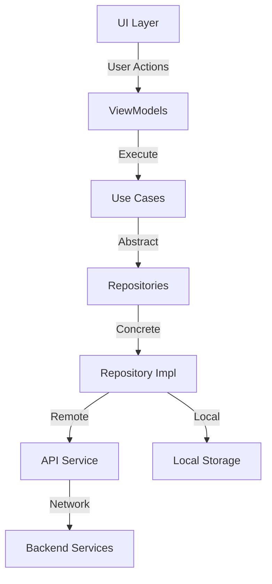

# YahApp - Professional Job Search Platform 🚀

<div align="center">
  
  <h3>Modern Android Job Search Platform with AI Integration</h3>
</div>

## Overview 📱

YahApp is a comprehensive Android application designed to revolutionize the job search experience by leveraging modern technologies and AI capabilities. Built with Clean Architecture principles and the latest Android development practices.

<details>
<summary>🏗️ Architecture</summary>

### Clean Architecture Implementation

```
com.cortech.yahapp/
├── core/                          # Core functionality shared across features
│   ├── data/                      # Data layer implementation
│   │   ├── api/                   # API interfaces for network calls
│   │   │   ├── auth/             # Authentication APIs
│   │   │   ├── chat/             # Chat & AI APIs
│   │   │   ├── jobs/             # Job-related APIs
│   │   │   └── profile/          # User profile APIs
│   │   ├── local/                # Local storage (SharedPreferences)
│   │   ├── model/                # Data models
│   │   └── repository/           # Repository implementations
│   ├── domain/                   # Business logic & use cases
│   │   ├── model/                # Domain models
│   │   ├── repository/           # Repository interfaces
│   │   └── usecase/             # Use cases for business logic
│   └── presentation/             # UI components & themes
└── features/                     # Feature modules
    ├── home/                     # Home feature (Chat, Jobs)
    ├── profile/                  # User profile management
    ├── register/                 # User registration
    └── splash/                   # App initialization
```

### Architecture Flow Diagram


</details>

<details>
<summary>🌐 API Integration</summary>

### External Services

1. **User Authentication & Profile API**
   ```
   Base URL: https://hackaton-rails-api.duckdns.org:3000
   Endpoints:
   - GET /users/?name={user_name}
   - POST /users/
   ```

2. **Job Positions API**
   ```
   Base URL: https://api-ai-solution.vercel.app
   Endpoints:
   - GET /jobs/recommended
   - POST /jobs/position
   ```

3. **Google Gemini AI Integration**
   - CV Analysis
   - Job Recommendations
   - Natural Language Chat

</details>

<details>
<summary>🛠️ Technical Stack</summary>

### Core Technologies

- **UI Framework**: Jetpack Compose
- **Architecture**: MVVM + Clean Architecture
- **Dependency Injection**: Hilt
- **Networking**: Retrofit 2.9.0 + OkHttp 4.12.0
- **JSON Parsing**: Gson 2.10.1
- **Async Operations**: Kotlin Coroutines & Flow
- **Local Storage**: SharedPreferences
- **AI Integration**: Google Gemini

### Key Features

- Material 3 Design
- Dark/Light Theme Support
- PDF Processing
- Real-time Chat
- AI-powered Job Matching
- Profile Management
- Secure Authentication

</details>

<details>
<summary>🔧 Setup & Configuration</summary>

### Prerequisites

- Android Studio Hedgehog or later
- JDK 17
- Android SDK 34
- Kotlin 1.9.0

### Configuration

1. Clone the repository
   ```bash
   git clone https://github.com/yourusername/yahapp.git
   ```

2. Add your API keys in local.properties:
   ```properties
   GEMINI_API_KEY=your_api_key_here
   ```

3. Sync project with Gradle files

4. Run the app on an emulator or device

</details>

<details>
<summary>📱 Features</summary>

### Core Functionality

1. **Authentication**
   - User Registration
   - Profile Management
   - Role-based Access (HR/Employee)

2. **Job Search**
   - AI-powered Job Recommendations
   - CV Upload & Analysis
   - Position Matching

3. **HR Tools**
   - Job Position Creation
   - Candidate Search
   - CV Review

4. **Chat Interface**
   - Natural Language Interaction
   - Job-related Queries
   - CV Analysis Results

### Screenshots

[Screenshots will be added here]

</details>

<details>
<summary>👥 Contributing</summary>

We welcome contributions! Please follow these steps:

1. Fork the repository
2. Create a feature branch
3. Commit your changes
4. Push to the branch
5. Open a Pull Request

Please ensure your code follows our coding standards and includes appropriate tests.

</details>

## License 📄

```
MIT License

Copyright (c) 2025 YahApp

Permission is hereby granted, free of charge, to any person obtaining a copy
of this software and associated documentation files (the "Software"), to deal
in the Software without restriction, including without limitation the rights
to use, copy, modify, merge, publish, distribute, sublicense, and/or sell
copies of the Software, and to permit persons to whom the Software is
furnished to do so, subject to the following conditions:

The above copyright notice and this permission notice shall be included in all
copies or substantial portions of the Software.
```
